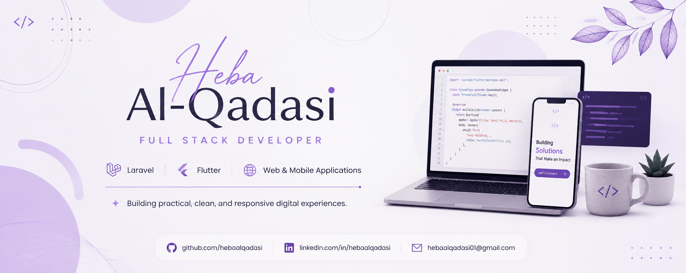

# Hi, I'm Heba Al-Qadasi 👋

### Full Stack Developer | Laravel & Flutter | Web & Mobile Applications

  

---

## About Me

I'm an Information Technology student and Full Stack Developer focused on building practical, responsive, and well-structured web and mobile applications.

I enjoy turning ideas into usable digital products, working across front-end interfaces, back-end logic, databases, APIs, and collaborative GitHub workflows.

- Building web applications with Laravel
- Developing mobile applications with Flutter
- Working with REST APIs and MySQL databases
- Interested in clean UI, responsive design, and structured teamwork
- Continuously improving through practical projects

---

## Tech Stack

---

## Featured Projects

### 🛍️ Heba Store

A responsive fashion e-commerce front-end built with HTML, CSS, and JavaScript.

**Highlights:** product filtering, authentication interfaces, wishlist, cart, checkout, dashboard, and dark mode.

[View Repository](https://github.com/hebaalqadasi/Heba_Store_Project)

---

### 👜 Lozan Bags Landing Page

A responsive Arabic RTL landing page designed for Lozan Bags.

**Highlights:** product categories, responsive mobile design, WhatsApp integration, product filtering, and brand-focused UI.

[View Repository](https://github.com/hebaalqadasi/lozan-bags-landing-page)

---

## Currently Building

- Laravel REST APIs
- Flutter mobile applications
- Full-stack graduation and university projects
- Better GitHub collaboration and project documentation workflows

---

## GitHub Activity

---

## Connect With Me

  

---

### Building, learning, and improving through real projects.

